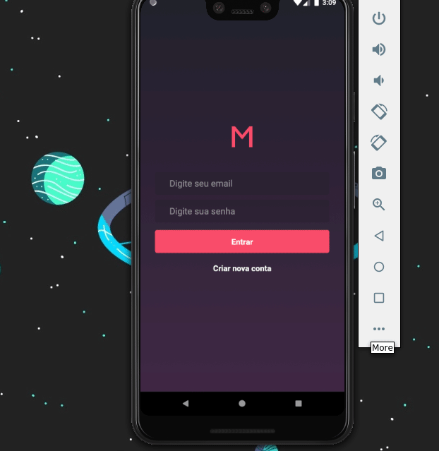

# Meetapp Mobile

The Meetapp application was build with React Native by using the API developed in this repository (<a href="https://github.com/saaddalida/meetapp-backend" target="_blank" rel="noopener noreferrer">Meetup Backend</a>).

This application will be used by meetup subscribers and will not have meetup organization features.

## Screens



This application have five screens: Authentication, SignUp, Dashboard, Subscriptions and Profile.

### Running application

To clone and run this application, you'll need [Git](https://git-scm.com), [Node.js v10.16][nodejs] or higher + [Yarn v1.13][yarn] or higher installed on your computer and the [MeetApp API](https://github.com/saaddalida/meetapp-backend). From your command line:

```bash
# Clone this repository
$ git clone https://github.com/saaddalida/meetapp-mobile.git

# Go into the repository
$ cd meetapp-mobile

# Install dependencies
$ yarn install

# Run the app (iOS)
$ react-native run-ios

# Run the app (Android)
$ react-native run-android
```

## Built With

- [ReactJS](https://reactjs.org/)
- [Redux](https://redux.js.org/)
- [Redux-Saga](https://github.com/redux-saga/redux-saga)
- [styled-components](https://www.styled-components.com/)
- [react-native-vector-icons](https://github.com/oblador/react-native-vector-icons)
- [Axios](https://github.com/axios/axios)
- [Immer](https://github.com/immerjs/immer)
- [react-native-linear-gradient](https://github.com/react-native-community/react-native-linear-gradient)
- [date-fns](https://date-fns.org/)
- [Reactotron](https://infinite.red/reactotron)
- [VSCode](https://code.visualstudio.com/)

## Authors

- **Dalida Saad** - :wave: [Get in touch!](https://www.linkedin.com/in/dalida-saad/)

## License

This project is licensed under the MIT License.
